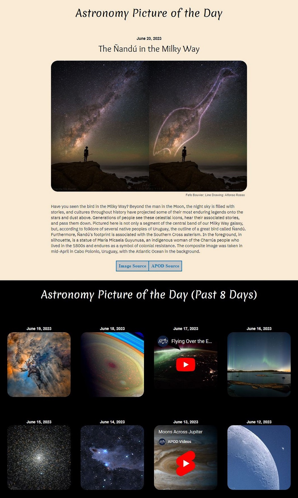
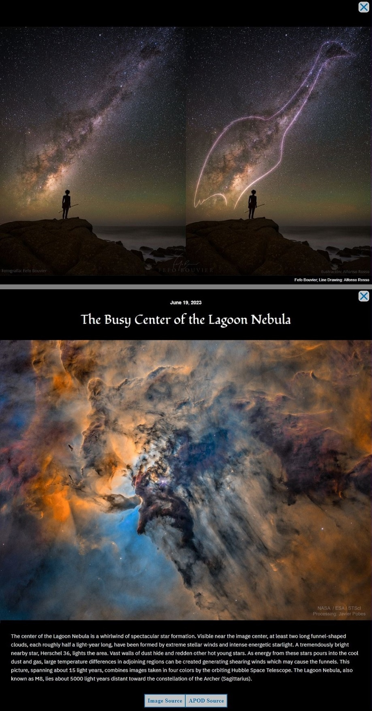

# NASA API — Astronomy Picture of the Day (APOD)

This project calls the NASA APOD API and outputs the media data for today and the previous 8 days.

Each image can be enlarged by clicking on the image, and a modal image will display. Associated with each image are two link. The "Image Source" link directs to the image URL on NASA's website, and the "APOD Source" link directs to the NASA APOD webpage pertaining to the image.

## Live Demo

[**Project URL**](https://codepen.io/phillipbury/live/LYXZPpE)

***NOTE:*** If the media doesn't load, then it's very likely that the API is down for maintenance or isn't currently working. To test the NASA APOD API request, click on the JSON URL [https://api.nasa.gov/planetary/apod?api_key=DEMO_KEY](https://api.nasa.gov/planetary/apod?api_key=DEMO_KEY)

## Screenshots

  
  

## Installation & Usage

### `virtual environment`

1. Download the project files. [Click here to download](https://github.com/phillipbury/api-nasa-apod/archive/refs/heads/main.zip)
2. Download a local server such as [XAMPP](https://www.apachefriends.org), [WAMP](https://www.wampserver.com/en), or [MAMP](https://www.mamp.info/en/windows).
3. In the local server environment, access the project `index.html` file, and the webpage will load.

### `web hosting`

1. Download the project files. [Click here to download](https://github.com/phillipbury/api-nasa-apod/archive/refs/heads/main.zip)
2. Use the HTML, Less & JavaScript files on your webpage.

#### Web Hosting Notes:

- The two libraries being used are [jQuery](https://jquery.com/) for JS & [Pure Grids](https://purecss.io/grids) for CSS.
- The CSS wrapper for the project is `class="nasa-apod"`
- `.less` files will need to be complied to obtain the CSS.

## NASA API Key

The public `DEMO_KEY` can be used, or a rate limit increase can be obtained by signing up for a [NASA developer key](https://api.nasa.gov/).

### Rate Limits

- `DEMO_KEY`
  - Hourly Limit: 30 requests per IP address per hour
  - Daily Limit: 50 requests per IP address per day

- **NASA Developer Key**
  - Hourly Limit: 1,000 requests per hour

## License

This module is licensed under the [GNU General Public License v3.0](https://github.com/phillipbury/api-nasa-apod/blob/main/LICENSE)
